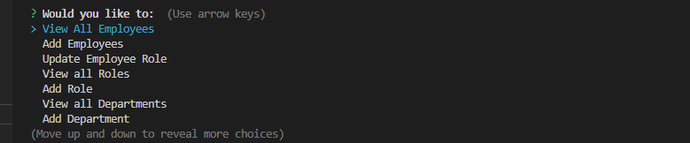
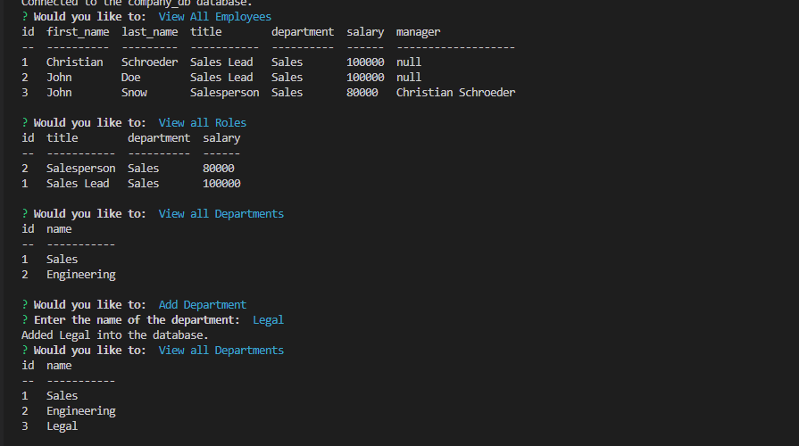
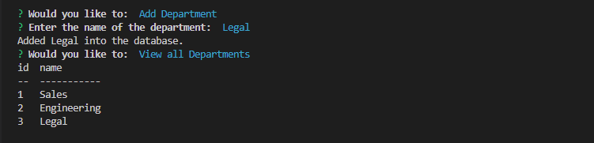
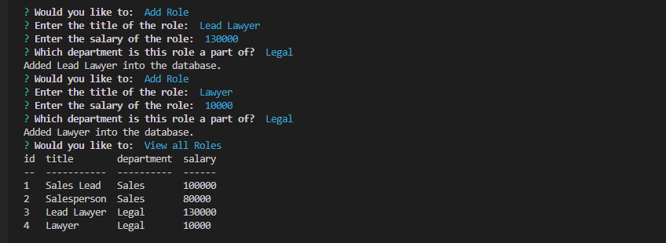
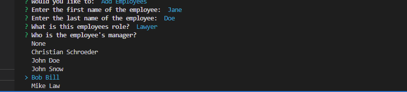
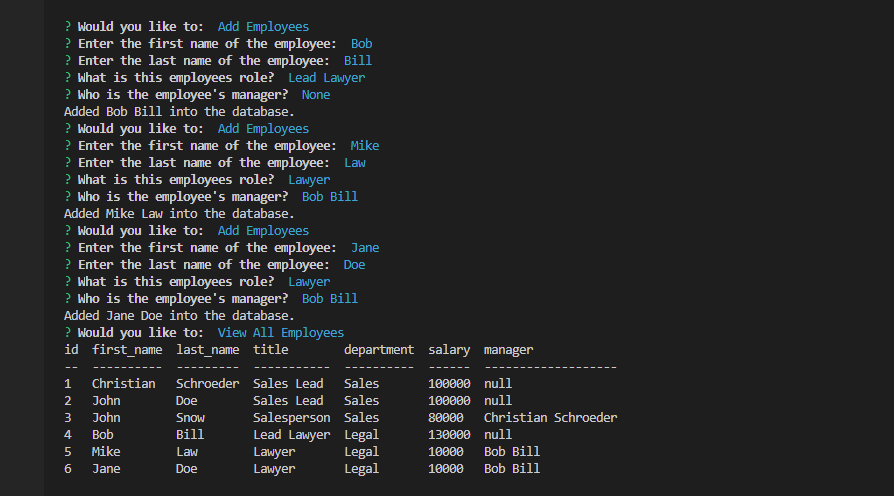
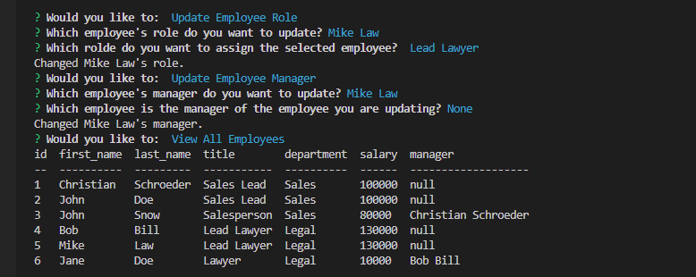
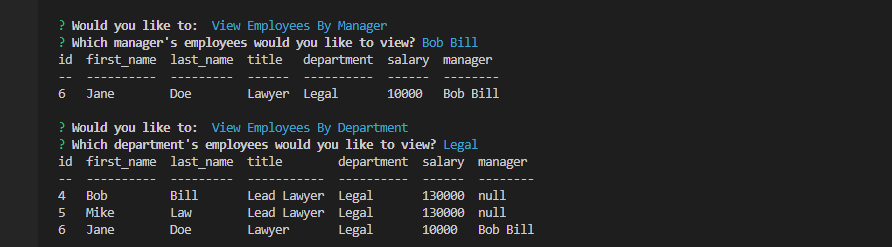

# Employee Tracker

## Description

This program can be used to keep track of employees in a company. Through the use of SQL databases we keep track of departments, roles, and employees. This program lets you add any of the 3 as well as view the tables in the database. You can also update the employees role through this program.

## Table of Contents

* [Technologies](#technologies)
* [Installation](#installation)
* [Usage](#usage)
* [Questions](#questions)
* [License](#license)

## Technologies

| Technology | Link |
| -------- | ------|
| HTML |   |
| Javascript |    |
| Node.js | https://nodejs.org/en/ |
| npm | https://www.npmjs.com/ |
| mysql2 | https://www.npmjs.com/package/mysql2 |
| inquirer | https://www.npmjs.com/package/inquirer |
| console.table | https://www.npmjs.com/package/console.table |

## Installation

Run npm install in console. Run mysql in project directory, initalize db with tables by running source db/schema.sql while in the mysql terminal at the root of the project directory

## Usage

Link to video showing usage: https://www.youtube.com/watch?v=YvlRWNYMtF4  

When you first open the program you will be presented with a menu with all of the options available in this program. You may use the arrow keys on your keyboard to select any of these options. The options include: view all employees, view all roles, view all departments, add employee, add role, add department, update employee's manager, update employee's role, view employees by manager, view employees by department, and a quit to exit the program. Here is a picture of what the menu looks like:  

  

On selecting any of the views a table of all current departments/roles/employees will be shown based on which you decided to view. An example database looks like:  

  

You may add in a department which is the highest level of the database, example add here:  

  

You may add in a role, the middle level of the database. You will be asked which department to select and be given options matching the departments in the database. Example role addition:  

  

The last level of the database is an employee which you can also add to the database. You will be asked for a first and last name, a role with the given options being the roles in the database, and a manager with the options being the employees that are already in the database. If the employee has no manager select none. Example manager selection list:  

  

After all of these have been filled out your employee will be in the database and you can view the employees by selecting the view employees option. This is what adding employees to the database would look like:  

  

You may also update certain aspects of an employee's entry. Specifically an employee's role and manager. Just select either of the options and you will be asked questions on what their new role/manager should be. After answering the table will now show the employee's with updated information. Example updates:  

  

Lastly you can view the employee's list based off of certain criteria. Just select which option, department or manager, and will be able to select which department/manager you want to view employees by and you will see a list of employee's matching the criteria. Example of lookups:  

  

## Questions
If you have any questions you can reach me at:  
Github: cmwschroeder  
Github link: https://github.com/cmwschroeder  
Email: cmwschroeder@gmail.com

## License

Licensed under the [MIT License](LICENSE)